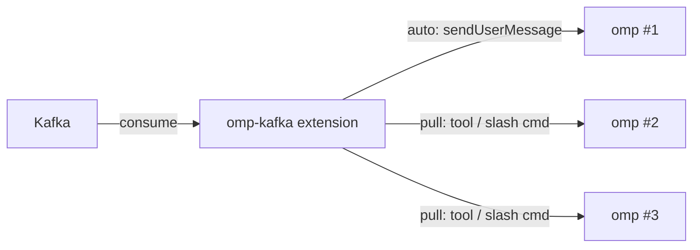

# omp-kafka

Part of [`toxicwind/tau-extensions`](https://github.com/toxicwind/tau-extensions) — a monorepo of oh-my-pi (`omp`) extensions.

An [oh-my-pi (`omp`)](https://github.com/can1357/oh-my-pi) extension that lets an `omp` (or `pi`) instance subscribe to Apache Kafka topics and surface the messages in two ways:

- **auto (push) mode** — every consumed message is delivered into the running session as a user message (`sendUserMessage`) and shown as a `ctx.ui.notify`, so the LLM can react to it without any explicit request.
- **pull mode** — messages are buffered silently. The user (or the LLM, via the `kafka_consume` tool) pulls them on demand with `/kafka-tail`, `/kafka`, and `/kafka-reload`.

The wiring per instance is configured by a single `kafka.yml` file. One repo = many instances, each with its own client ID, topic set, and group ID.



## Install

Requires `omp >= 17.0.0`.

### Option A — clone the monorepo and link

```bash
git clone --depth 1 --filter=blob:none --sparse https://github.com/toxicwind/tau-extensions ~/.tau/agent/extensions/omp-extensions
cd ~/.tau/agent/extensions/omp-extensions
git sparse-checkout set packages/omp-kafka
cd packages/omp-kafka
bun install
omp plugin link .
```

The whole monorepo can be cloned if you want other extensions too — drop `--filter=blob:none --sparse` and the `sparse-checkout` lines.

### Option B — install via npm (once published)

```bash
bun add -g @toxicwind/omp-kafka
```

Then add to `~/.tau/agent/config.yml`:

```yaml
extensions:
  - @toxicwind/omp-kafka
```

### Option C — load once for a single session

```bash
omp --extension /path/to/omp-extensions/packages/omp-kafka
```

## Configure

Create `kafka.yml` next to your project (or pass `--kafka-config <path>` via `KAFKA_CONFIG` env). The file is a list of consumer profiles, each with its own brokers, topics, group ID, and mode:

```yaml
# ~/.tau/agent/kafka.yml
consumers:
  - name: events
    mode: auto               # "auto" (push) or "pull"
    brokers:
      - localhost:9092
    clientId: omp-events
    groupId: omp-events
    topics:
      - user.signup
      - billing.invoice
    fromBeginning: false
    notify: true             # also flash a UI notification on each message
    maxQueue: 500
    auto:
      deliverAs: steer       # "steer" or "followUp" (only meaningful in auto mode)
      prefix: "[kafka:events] "

  - name: ops-pull
    mode: pull
    brokers:
      - kafka.internal:9092
    topics:
      - ops.alerts
    # Everything else falls back to sensible defaults.
```

### Field reference

| Field | Default | Notes |
|---|---|---|
| `name` | required | Unique per `kafka.yml`. Used in `/kafka-*` commands and `ctx.ui.setStatus`. |
| `mode` | required | `auto` = push to session; `pull` = buffer only. |
| `brokers` | required | Non-empty array of `"host:port"` strings. |
| `topics` | required | Non-empty array of topic names. |
| `clientId` | `"omp-kafka"` | KafkaJS client ID. |
| `groupId` | `"omp-kafka-<name>"` | Consumer group. Set explicitly to share with another consumer. |
| `fromBeginning` | `false` | `false` = latest offset on first connect (good for live tails). |
| `notify` | `true` | Flash a UI notification for each message (works in both modes). |
| `maxQueue` | `200` | Ring-buffer size for the in-memory tail. Older records drop off. |
| `auto.deliverAs` | `"steer"` | How `sendUserMessage` injects: `steer` (current turn) or `followUp` (queued). |
| `auto.prefix` | `"[kafka:<name>] "` | Prepended to the formatted record body. |
| `sasl` | unset | `{ mechanism, username, password }` for SASL auth. |
| `ssl` | `false` | Enable TLS. |
| `clientConfig` | `{}` | Extra KafkaJS `KafkaConfig` fields. |

### Resolution order

`loadConfig` looks for the config in this order (first hit wins):

1. `$KAFKA_CONFIG` (absolute path wins, otherwise resolved against `cwd`).
2. `<cwd>/kafka.yml`.
3. `<cwd>/.tau/kafka.yml`.
4. `~/.tau/agent/kafka.yml`.

## Slash commands

| Command | Effect |
|---|---|
| `/kafka` | List every consumer and its current status. |
| `/kafka-tail <name> [limit]` | Print the last `limit` records (default 20) from `<name>`'s ring buffer. |
| `/kafka-drop <name>` | Clear `<name>`'s ring buffer. |
| `/kafka-reload` | Disconnect every consumer and reconnect (re-reads `kafka.yml`). |
| `/kafka-pause <name>` | Stop fetching new records (keep the buffer). |
| `/kafka-resume <name>` | Resume fetching for a paused consumer. |

The status line at the bottom of the TUI mirrors the same info: `kafka: events[auto]=running (12)  ops-pull[pull]=idle`.

## LLM-callable tool

`kafka_consume` is registered automatically. The LLM can call it to peek at the ring buffer without the user invoking a slash command:

```json
{
  "name": "kafka_consume",
  "parameters": {
    "consumer": "string? — name from kafka.yml",
    "limit":    "integer 1..500? — default 20",
    "since":    "ISO 8601 timestamp? — only records after this"
  }
}
```

## Environment overrides

| Variable | Effect |
|---|---|
| `KAFKA_DISABLED=1` | Skip connect on startup (config still loads). |
| `KAFKA_DEBUG=1` | Log lifecycle and connect events to stderr. |
| `KAFKA_CONFIG=<path>` | Force a specific config file. |

## Verification

The package typechecks cleanly and a symlink at `~/.tau/agent/extensions/omp-extensions/packages/omp-kafka` makes omp auto-discover the factory at load.

## License

MIT — see [LICENSE](./LICENSE).
